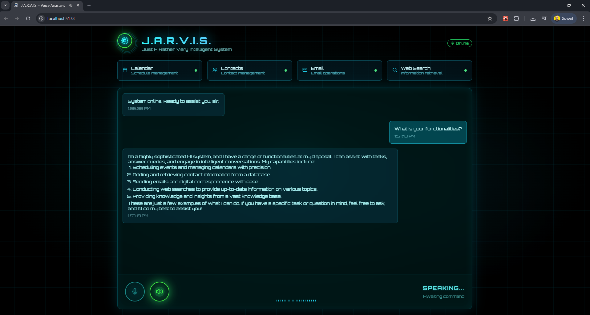

# 🤖 Jarvis — Your AI Voice Assistant Inspired by Iron Man

**Bring your own J.A.R.V.I.S. to life and enhance your digital workflow with natural voice interaction.**

This repository contains two powerful implementations of **Jarvis**, an AI voice assistant that combines advanced **Speech-to-Text (STT)**, **Text-to-Speech (TTS)**, and personal productivity tools (calendar, contacts, email, web search, and more).

---

## 📁 Repository Structure

```bash
Jarvis/
│
├── Jarvis CLI Edition/           # Terminal-based Jarvis Assistant
│   └── README.md                 # Documentation and setup for CLI version
│
├── Jarvis Interface/            # Full-stack Jarvis with Django backend + React frontend
│   └── README.md                # Documentation and setup for full-stack version
│
└── README.md                    # You're here!
```
## 🧠 What's Inside?

### ✅ Jarvis CLI Edition  
**Located in:** `/Jarvis CLI Edition`

A lightweight, terminal-based assistant built in Python. Perfect for voice-powered task automation directly from your terminal.

- 🎙️ Speech-to-Text / Text-to-Speech  
- 📅 Google Calendar & 📧 Gmail integration  
- 🗣️ Voice command execution  
- 📂 File-based knowledge base  
- ⚡ Fast, portable, and easy to deploy
  
📖 [Go to CLI README](<./Jarvis CLI/README.md>)

### 🌐 Jarvis Interface  
**Located in:** `/Jarvis Interface`

A full-featured assistant with a stunning modern **React interface** and **Django backend**, delivering an immersive, futuristic Jarvis-like experience.

- 🖥️ Visual + voice interaction  
- 🛠️ Integrated tools (calendar, contacts, emails)  
- ⚡ Real-time responses powered by AI  
- ⚙️ React + Vite frontend and Django backend  

📖 [Go to Interface README](./Jarvis%20Interface/README.md)

---

### 🔑 Requirements (For Both Versions)

Each version has its own `README.md` with full setup instructions, but in general you’ll need:

- 🐍 Python 3.9+  
- 🧰 Node.js + npm (for Interface version)  
- 🔐 API Keys:  
  - Google API (Calendar, Gmail, Contacts)  
  - Deepgram API  
  - Tavily API  
  - Groq API (LLaMA 3)  
  - Gemini API (optional)  
- 🗂️ `.env` file to store your credentials  
- 🧪 Virtual environment recommended for Python packages
---

## 🌟 Showcase



